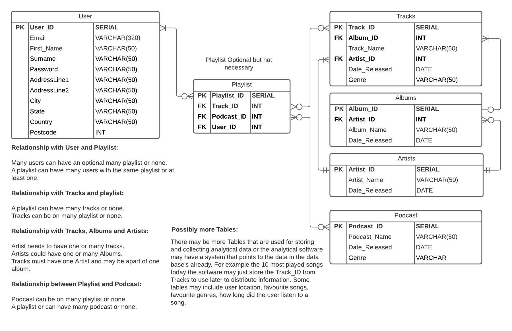
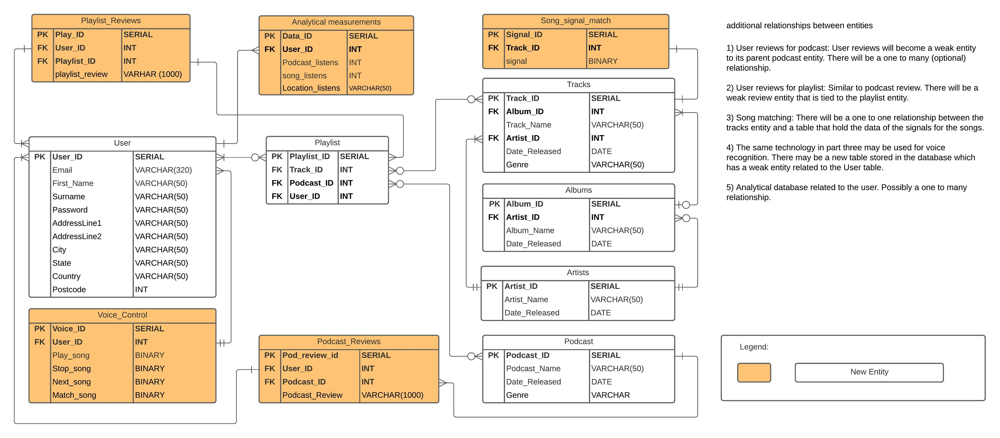

##### T3A2 - Written Report/Proposal 
# Research and Improve an Application Stack

### Brief:

You must fill in the gaps, and the empty dot points and show an educator:

You have always been interested in music and you have always admired this particular organisation: Spotify and the way they:

1) Allow the user to stream any song they want when they want to a high quality.
2) Allow the user to design playlists for different scenarios such as gym or chilled music.
3) Allow the user to search their friends playlists.
4) Allow the user to listen to podcasts.

You are now in a position to make a pitch to them about how to do something better or how they can take their ________ to the next level, but you need to formalise your approach by developing a deep understanding of their application stack and business priorities/functions.

### R1) Research and describe the technologies used to deliver services or products of your chosen organisation in terms of:

##### Presentation layer:
Bootstrap - User interface components for html, CSS and JS.  Pre-made templates. 
Chromium Embedded Framework - adds browsing functionality to the app. Also uses JavaScript, HTML and CSS to create the users interface. Gives web app functionality that rivals a native app without the large downloads or hardware requirements.

##### Business/application layer:
C++ - Used for functionality in the frontend with Javascript.
python - used for backend services and data analysis.
NGINX - Both webserver and proxy. Spotify use 5000+ servers.
JAVA - Used because the hadoop and NGINX software is built on JAVA.
G suite - Collabration for working in teams.
AdRoll - Used for when customers leave the application that they can still target customers with ads and marketing.
Qualaroo - Customer Surveys.
Desk.com - Delivering responsive customer service.
Blossom - Used for project management.
Amazon cloud front - Delivers content based on there geographic position which increases speed to users.
Kafka - Connecter that sends messages between systems. Integrates systems without thinking massive changes in infrustructure. 
Apache Storm - process's unbounded streams of data in real time processing.
Docker - Develops apps inside containers so they can be used across multi-platform systems. 
TestFlight - Spotify use it to test for IOS platforms only.
New Relic - Toubleshooting and Optimizing performance in web servers. 
Datadog - Data analytics for perfomance monitoring.
Pingdom - More performance monitoring. It alerts spotifies devs when there is an issue.
Percy - spot UI bugs quickly and review visual changes easily.
apache cloudfront - Used to deploy and manage large networks of virtual machines. Probably used with Docker.

##### data access layer:
hadoop - Processing data in parallel rather then serial. Mapreduce algorithm. Open source. Data normally needs to be greater then 10 Terabytes. Tells spotify who is using the service, how often, and what tracks are listened too.
Amazon S3 - Cloud elastic storage for databases.
Cassandra - Similar to SQL. It stores data in The Cassandra Query Language(CQL). Spotify us 33 casandra clusters holding 50+ terabytes of data.
PostreSQL - Software for storing relational data in a database.
Google BigQuery - Analyse terabytes of streaming data.
Google Cloud Bigtable - Spotify use's it for storage of its data. Spotify store up to 20 million songs and 24 million user's data.

### R2) Identify ONE application stack utilised by an organisation to deliver a product or service.
##### Describe the role of each technology used within an application stack and how it relates to other applications/technologies in a stack.

One service on spotify is the ability to make a playlist and store it in your profile.

First of all a user will need to access the website or download the application. The user will need to connect to the NGINX server hosted by Amazon cloud front which will determine where the user is located to maximise the speed of connection by minimising distance to one of 5000+ web servers running by spotify. The connection may be authenticated with possibly NGINX authentication process which makes subrequests to an external http server to verify. NGINX does have a username and password procedure. The backend NGINX webserver framework may be run on the python platform considering 80% of the backend is written in python according to an article from Geoff van der Meer from engineering.atspotify.com. The other 20% is made up of Java, C and C++.

To react with the NGINX web server the user will need a UI ( user interface ). Chromium Embedded Framework is used which is a type of open source web browser that use's HTML, CSS and Javascript to display all the view components. Another source Richard Gall hub.packtpub.com states that the user interface was written primarily with Javascript and C++ was used for functionality. Possibly the C++ was used with bootstrap framework for premade interactive icons. 

Once the user was able to make a get and post request through the user interfaces it was now possible to interact with the database to search and store songs. To search songs it is possible that a PostgreSQL database can be linked to the NGINX web server using python. There is an adapter called psycopg2 that connects to the database. Considering spotify use 33 casandra clusters holding 50+ terabytes of data. I assume that Cassandra is used at the primary database source. Cassandra is known to be distributed, has higher performance capabilties and higher availability over its counterpart postgreSQL. I assume that the queries are made through python to the casandra base that returns the address of the music files where they are stored on Google Cloud BigTable. If a user want to set up a playlist a new table will be created linking to the user with the address's of the music files in the cassandra profile. Using Javascript or bootstrap will allow a display to the user in the form of a list of the songs in a table. 

https://engineering.atspotify.com/2013/03/20/how-we-use-python-at-spotify/#:~:text=Spotify's%20backend%20consists%20of%20many,a%20big%20focus%20for%20Spotify.
https://hub.packtpub.com/spotify-has-one-of-the-most-intricate-uses-of-javascript-in-the-world-says-former-engineer/

### R3) Research the hardware/cloud platform(s) that are utilised by the organisation and describe what hardware is required. If specific information is not available, find data on the number of users

Spotify had there own infrustructure but they moved to google cloud platform in 2016 so they can focus on more in-depth interactive analysis, more input in product development, feature testing and to focus more on user experience and user interface.

- Spotify use 5000+ servers.
- 138 million subscribers. With monthly active users over 300 million.
- more then 50 million songs and 700000 podcasts available.
- 40000 new songs are added daily.

System requirements for user:

    iOS: iOS 12 or above
    Android: Android OS 4.1 or above
    Mac: OS 4.1 or above
    Windows: Desktop and laptops running windows 7 or above.

System cloud platforms:

- Spotify split there migration into two streams which one is a services track and the other a data track. Spotify runs their product on many tiny microserices in the google cloud. 
- Spotify takes advantage of Google cloud's use of ultra high IOPS SSD and local SSD storage that has autoscaling technologies.
- Spotify uses Google Cloud Datastore and google cloud Bigtable.
- Spotify is also deploying Google clouds networking services such a Direct Peering, Cloud VPN and Cloud Router to transfer perabytes of data. Google claims this is faster, reliable and more secure experience.
- Spotify are moving from hadoop, MapReduce and Hive to taking on the new data processing technology tools such as Google Cloud Pub/Sub, Google Cloud Dataflow, Google Bigquery and google cloud dataproc. Guillaume Leygues, lead sales engineering at google claims that the new technology will run complex queries in a matter of minutes instead of hours.

Hardware:

The hardware is elastic and auto-deployed with the google cloud. According to Guillaume Leygues from google he states they have utra high IOPS SSD and local SSD storage that has autoscaling.

https://cloud.google.com/blog/products/gcp/spotify-chooses-google-cloud-platform-to-power-data-infrastructure.
https://www.businessofapps.com/data/spotify-statistics/#4

### R4) Research the data model of an organisation by looking at their API documentation and any other sources of publicly available information and describe the organisational functions that are possible based on the API. 

Spotify use a REST Web API with endpoints that return JSON metadata. 

##### Albums:
Albums endpoints can get an album, get and an albums tracks or get several albums.

##### Artists:
Artists can get an artist, artist's album, artists top tracks, related artists or get several artists.

##### Browse:
Browse can get a Category, Category's playlist, list of Categories, list of featured playlists, list of new releases and finally recommendations

##### Episodes:
Episodes endpoints can get one or several Episodes from the spotify catalogue.

##### Follow:
Follow can check if Current user follows an artist or another user. It can check if the user follows a playlist. It can activate a user to follow an artist or playlist. Get the current users followed Artists. Remove the current user from following an artist or finally unfollow a playlist.

##### Library:
Library can check Users Albums,shows,Tracks. Can get Users Albums, shows, tracks. Remove albums, shows and tracks from the user. Saves albums, shows and tracks for user.

##### Personilazation:
Get a Users Top Artists and tracks.

##### Player:
Get: 
- Users available Devices
- Users current playback
- Users Recently played tracks
- Users Currently played track

There is also pause, seek which changes position in current track, Repeat mode, adjusting volume, skip playback, start and resume a user's playback, Shuffle and transfer a users playback.

##### Playlists:
There is add items to a playlist feature, change a playlists details, Create a playlist, get a list of current users playlist, get a list of any users playlist, get any playlist, cover images or items, remove items from a playlist, Reorder and replace playlists items and finally upload a custom image. 

##### Search
Just searchs for an item.

##### Shows 
Get a show, several shows or show episodes.

##### Tracks
Get:
- Audio analysis for a track
- Audio features for a track
- Audio features for several tracks
- Several tracks
- Single track

##### Users Profile
Get Current user's profile or another users profile.

### R5) Create an entity relationship diagram which represents entities used in a product or service (or part of) and the relationships between them. You are free to speculate on the properties of entities and the relationships between entities.

### R6) Describe TWO processes for the input and output of data based on the company’s API and how they achieve organisational objectives. (300 words)

#### Playlists:

Spotify Web API has many available process's for developers to work with. I selected the Playlists process because it has many METHODS or verbs to request or change data. In other words input and output. One of spotifies main features is to design and store a list of selected songs by the user. Furthermore an extra feature is that you can look up a friends playlist to select and play songs as well. Looking at the endpoints it looks like there are two tables in a database that the developer will interact with within the web API. playlist_id which would associate with some sort of playlist Table and user_id which would associate with the user table. Similar to the diagram in R5. Spotify organisational objective in the web API is to allow developers to integrate spotify into their own apps or websites through endpoints. For example a developed can set up a link or button on there website that can allow anyone who visit's the developers website to access the developers playlist.  

##### Input data for Playlists:

Base URL: https://api.spotify.com/v1

| Process                               |    Endpoint                             | Verb  |
|---------------------------------------|-----------------------------------------|-------|
| Add items to a playlist               |    /v1/playlists/{playlist_id}/tracks   | POST  |
| Change a playlist details             |    /v1/playlists/{playlist_id}          | PUT   |
| Create a Playlist                     |    /v1/users/{user_id}/playlists        | POST  |
| Remove Items from a Playlist          |    /v1/playlists/{playlist_id}/tracks   | DELETE|
| Reorder a Playlist's Items            |    /v1/playlists/{playlist_id}/tracks   | PUT   |
| Replace a Playlist's Items            |    /v1/playlists/{playlist_id}/tracks   | PUT   |
| Upload a Custom Playlist Cover Image  |    //v1/playlists/{playlist_id}/images  | PUT   |

##### Output data for playlist:

Base URL: https://api.spotify.com/v1

|Process |Endpoint|Verb|
|---|---|---|
| Get a List of Current User's Playlists | /v1/me/playlists | GET |
| Get a List of a User's Playlists | /v1/users/{user_id}/playlists | GET |
| Get a Playlist Cover Image | 	/v1/playlists/{playlist_id}/images | GET | 
| Get a Playlist | 	/v1/playlists/{playlist_id} | GET |
| Get a Playlist's Items | 	/v1/playlists/{playlist_id}/tracks | GET |

 
#### Machine learning to design playlist for users:

This one was not in the public Web API references but I thought I will do some research and talk about it. There is a feature that spotify try's to use to enhance user experience by trying to predict what tracks a user would want to listen too. Then create a playlist for the user with those tracks. What spotify does is use user search query's as an input. Runs it through a machine learning algorithm which finds user's similar language, feel of the song, play logs and filtering to output a very accurate playlist suggestion that you may like. As far as organisation objectives this feature gives the user great user experience. It minimise time to search randomly for good/relevant songs. It also reduces energy in searching that may lead to bordom or atleast bad user experience.

##### Input data for algorithm:

I would assume that the data can be collected from three sources such as Albums, Artist or Browse API endpoint references. In those reference any of the GET request could return data necessary for the algorithm inputs. For eg:

- Get an Album
- Get an Albums tracks
- Get an Artist 
- Get an Artists Albums

##### Output data for algorith:

The output data would simply be in the form a suggested playlist that will pop up in users home page.

### R7) Develop an extension or modification of the existing data model to improve an organisational function. You should provide details about:
- additional entities
- additional relationships between entities
- additional input or outputs
- additional processes
- which entities would be part of a public API
#### additional entities

1) User review system for podcast: Currently you can select your category but you cant identify between unkown podcasts to see if they are actually any good.
2) User review system for playlist: There does not seem to be a review system for playlist. I do take into consideration that they have followers that could mean that a playlist might be good but I think users can benifit more from written reviews and a star rating process.
3) Implement song matching similar to shazam that identifies a song by listening to it and automatically saves into a users playlist. 
4) Voice commands to primary user that may assist when driving.
5) Possibly could have an analytical data system to monitor users personal songs or personal podcast that have been uploaded similar to google analytics. Give suggestions on improving their podcasts based on data.

#### additional relationships between entities 
1) User reviews for podcast: User reviews will become a weak entity to its parent podcast entity. There will be a one to many (optional) relationship.
2) User reviews for playlist: Similar to podcast review. There will be a weak review entity that is tied to the playlist entity.
3) Song matching: There will be a one to one relationship between the tracks entity and a table that hold the data of the signals for the songs.
4) The same technology in part three may be used for voice recognition. There may be a new table stored in the database which has a weak entity related to the User table.
5) Analytical database related to the user. Possibly a one to many relationship.
#### additional inputs or outputs

The additional endpoints might look something like:

Base URL - https://api.spotify.com/v1/

| Process | Endpoint | Verb | Input/Output |
|---|---|---|---|
| Post a review | v1/podcasts/reviews/{review_id} | POST | Input |
| Find a review | v1/podcasts/reviews/{review_id} | GET | Output|
| Match a song  | v1/Tracks/match/{track_id}|POST| Input |
| Collect data on podcast | v1/podcasts/user_data/{podcast_id} | GET | Output |

#### additional process's
1) User reviews will need to have a POST request sent to store strings in a new table and a GET request to retrieve the data if requested through an API.  
2) Song matching and voice recognition I assume will need a machine learning algorithm or some algorithm that will compare a songs output with the ones in the database. I assume the database may need to be alot bigger to store the information required for the signal.
3) For part 5 in additional entities there will probably need a new process that may need to authenicate or/and authorise users to see the analytical data associated with their own podcasts.

#### which entities would be part of a public API? 

Definitly user reviews for podcast and playlist. The aim of a review is to give insight to the public. Possible song matching aswell. It might be worthwhile that someone wants to find out a playlist that someone likes the sound of instead pre-emptive designation into a playlist. 

#### explain how these changes will lead to an improvement.

- Well as explained earlier a review could save time to the user and resist the user from getting bored by randomly listening and searching through playlist and podcasts. 
- Song matching to find the name of a song can reduced frustration with a user and save them time therefore increasing user experience with the app. It is also another alternative method to search for songs considering searching for songs may be tedious and boring. 
- Users being able to monitor there own podcast with possible recommendations from a machine learning algorithm could have many improvements for the user and therefore a user may rely on the app which will bring more business to the company. One improvement may be if a user can improve there podcast then more people might want to sign up to listen to the podcast.

### R8) Create an entity relationship diagram(s) that describe the entities and relationships you propose to extend or modify the system. You must ensure that:

### R9) Justify the technical and operational feasibility of your improvement or extension to an organisational function by providing information about: 

#### How will the improvement be supported technically?

To design and implement the user review techonoloy in the podcast and playlist the developers will not need to do anything new. The technology is already being utilised else where in the software so no new technology needs to be implemented. Add-ons are required to existing infrustructer. To begin the project the manager will need to chat requirements with maybe a UX-UI designer to design the layout of the review chat boxes. Once the layout has been designed the two teams of front-end and back-end will split off and implement the add-on architecture with the manager running the devops. There will be on-going testing and monitoring.

To design and implement the Song matching technology similar to shazam may be difficult. To ensure that they are not accused of interlectual theft they will need to design the technology themselves or find an open-source technology. I assume that if they were to design it themselves that they might need a computer-science engineer or electrical engineer to monitor the signal an to transform the signal into something a computer understands. In the updated ERD diagram in R8 I assumed the signal may be picked up by a microphone and decoded into binary somehow. Once the signal can be converted the rest can be left up to the dev teams.

To design and implement the analytical monitoring of the user designed podcast and give feedback I would consider a machine learning algorithm. It most likely will be designed by a computer-science engineer or statician that can work in parallel with such technologies as google analytics or similar. The algorithm will assess what all the favourite podcasts will have as far as themes, character, tone, topics, categories and compare that to the user's current technologies. I expect there may be a degree of difficulty with dev ops. I assume there will be many prototypes and monitoring of bugs. 

#### How the improvement will effect stakeholders who utilise the system

Pro's and Con's to the users who design the podcast. There will be a filter that determines most liked and disliked. If your no good you will be found out but if you are good you will be rewarded. 

All improvements may risk software crashes or bugs with new tech. Updates may destroy current endpoint settings so websites may crash that are linked to spotify. Any ads may not be generated during crashes or data collected and sold. Actual share holders will be effected if that occurs. 

On the other hand if new upgrades and feature are successful and more people do sign up then advertising stakeholders will be willing to spend more money which may lead to cheaper subscription fees for users long term.

#### Additional cost that may be incurred to implement the improvement

Adding a review comments section in the spotify app will be quick and simple. So operations cost will be as cheap as any simple update or patch. Though there will be an ongoing expanse.  More data will need to be stored. So Spotify will either have to raise prices for the extra feature or have a loss to revenue. 

The additional cost for the song and voice matching technology may be expensive depending if the technology needs to be designed or found on open source. Also Spotify could offer a payment to buy the technology which could be very expensive also. There will definitly be additional cost in storing the extra data required to match 50 million songs. There might be extra cost in processing power to analyse the signals but neglible on the scale of spotify.

The analytical monitoring technology may be expensive short term. I dont believe that there will be expensive ongoing fees. The analytical data is already being collected. So short term will just be designing and implementing the algorithm with the engineers and dev ops.

### R10) Select TWO technologies in the organisation’s stack and provide an alternative solution/technology by comparing the alternative with the existing solution (use of tabular form OR prose is ok). 

